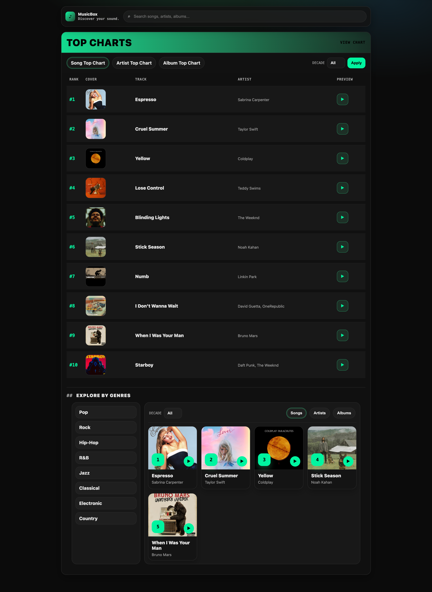
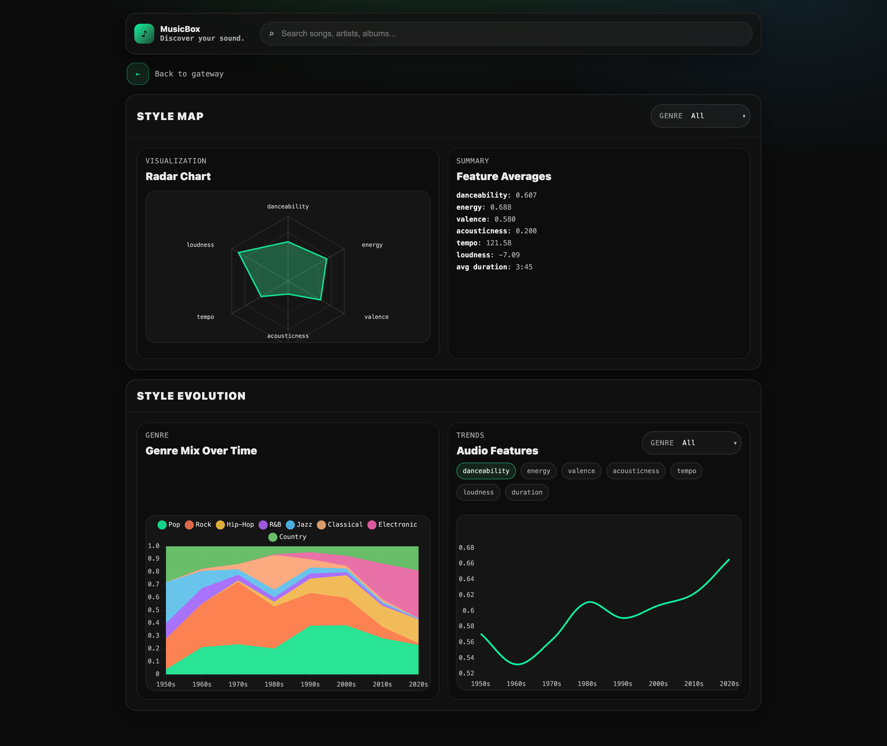
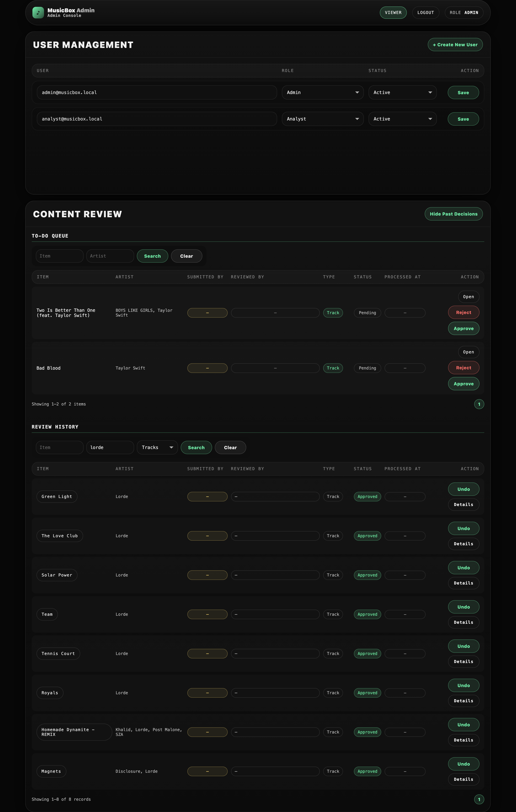
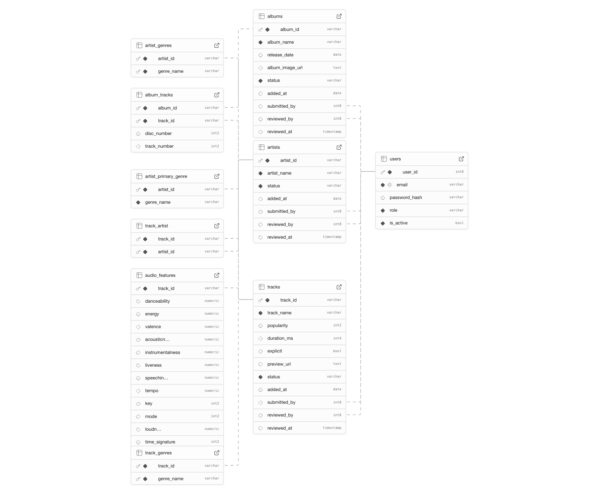

# 🎧 MusicBox — Spotify Analytics Database & Web Application

> **A production-ready full-stack data product that transforms raw Spotify metadata into an interactive analytics platform for music exploration, trend discovery, data-driven decision support.**

🎥 **Demo Video: (2-minute walkthrough)**
[]
(https://youtu.be/i5fJ1I15D9o)

👉 **Live Demo:** [https://musicbox-spotify-database.onrender.com/viewer](https://musicbox-spotify-database.onrender.com/viewer)  
*(Note: Hosted on a free tier; the initial load may require ~30 seconds for server wake-up.)*

---

## 🌟 Project Overview
MusicBox is an end-to-end analytics data product that demonstrates how structured data infrastructure powers analytics for streaming platforms and music labels. It enables exploration of music trends, audio characteristics, and popularity patterns to support data-driven content strategy, recommendation systems, and market decisions.

The platform features a custom ETL pipeline that cleans and ingests ~10,000 Spotify tracks from raw CSV (Spotify Web API data, 1950–present) files into a fully normalized PostgreSQL database. On top of this data foundation, the system provides an interactive web interface for querying, analyzing, and managing music data across different user roles.

By integrating data engineering, relational modeling, backend services, cloud deployment, and a role-based frontend, MusicBox simulates a real-world analytics platform used to transform raw data into actionable insights.

---

## 🧠 Key Features
* **📈 Interactive Top Charts & Exploration:** Browse and rank tracks, artists, and albums across decades and genres, simulating real streaming platform discovery workflows.

* **🔎 Deep Content Navigation:** Explore relationships between tracks, artists, and albums through detailed drill-down views.

* **⚡ Smart Search & Filtering:** Find tracks, artists, or albums by name using real-time keyword search, enabling precise exploration of large-scale music data.

* **📊 Advanced Music Analytics Dashboard:** Profile genre-specific audio characteristics, track changes in genre composition over time, analyze temporal trends in audio features, and interactively filter by genre for multi-dimensional exploration.

* **👥 Role-Based Access & Workflows:** Separate Viewer, Analyst, and Admin interfaces with controlled data access and permissions designed to reflect real-world data product environments.

* **🗄️ Scalable Data Pipeline & Schema Design:** Cleaned and structured Spotify data into a normalized relational database with optimized indexing for efficient analytical queries.

* **🌐 Cloud Deployment:** Deployed as a full‑stack web application on Render with a managed PostgreSQL backend (Supabase), enabling public access and real‑world usage.

---

## 🖥️ Interface Preview

<table>
  <tr>
    <td valign="top" width="50%">
      <b>1) Top Charts + Genre Exploration (Viewer)</b> 
      
    </td>
    <td valign="top" width="50%">
      <b>2) Artist Detail Page (Top Tracks + Albums)</b> 
      
    </td>
  </tr>
  <tr>
    <td valign="top" width="50%">
      <b>3) Analytics Dashboard — Style Map + Trends</b> 
      
    </td>
    <td valign="top" width="50%">
      <b>4) Admin Console — User Management + Content Review</b> 
      
    </td>
  </tr>
</table>

---

## 🧩 Application & Experience Layer

MusicBox is implemented as a workflow-oriented analytics application rather than a static dashboard, with interfaces and processes designed to mirror real-world data products.

### Application Layer

* **Role-Based Interfaces:** Dedicated Viewer (/viewer), Analyst (/analyst), and Admin (/admin) environments with distinct permissions and capabilities. Viewer supports public exploration, Analyst provides advanced analytics dashboards, and Admin enables operational management.

* **Content Review & Access Control:** Admin Console supports user management, role-based permissions, and a structured moderation workflow with queues, review history, and approve/reject actions.

* **Management Interfaces:** Administrative tools for maintaining tracks, artists, albums, and metadata at scale, with filterable tables and deep links to editing forms for updates and corrections.

### Experience Layer

* **Search & Suggestions:** Global keyword search with instant suggestions across artists, albums, and tracks, enabling rapid navigation through large catalogs. Management views also support search and combined filtering for efficient record retrieval.

* **Inline Audio Preview:** Embedded playback controls allow users to listen to 30-second track previews directly within charts and detail pages without leaving the interface.

* **Responsive Design:** Interfaces adapt to both desktop and mobile devices.

---

## 📈 Business Intelligence & Actionable Insights

This project demonstrates how large-scale music metadata can be transformed into decision-oriented insights through three analytical perspectives:

### 1. Genre Sound Profiling & Content Positioning (The "Style Map")
* **Audio Feature Profiling:** Radar visualizations quantify genre-specific key sound characteristics such as danceability, energy, valence, acousticness, tempo and loudness.
* **Business Value:** Enables platforms and content teams to position tracks within distinct “sound territories,” supporting playlist curation and catalog differentiation.

### 2. Genre Dynamics & Market Evolution (The “Style Evolution”)
* **Genre Mix Over Time:** Stacked visualizations reveal shifts in genre composition across decades, highlighting changing listener preferences.
* **Business Value:** Helps labels and platforms identify long-term market transitions and emerging genre opportunities for strategic investment.

### 3. Audio Trend Analysis & Catalog Strategy
* **Temporal Feature Trends:** Time-series analysis tracks how core audio characteristics evolve over time within selected genres.
* **Business Value:** Supports platforms to understand how musical styles evolve over time, enabling data-driven decisions on content acquisition, recommendation strategies, and catalog development to keep offerings aligned with shifting user preferences.

---

## 🏗️ System Architecture
**Data Source (CSV)** 
→ **ETL Processing (Python/Pandas)** 
→ **PostgreSQL (Supabase)** 
→ **Flask Backend (SQL/psycopg)** 
→ **Jinja/HTML Web UI** 
→ **Cloud Deployment (Render + Supabase)**

---

## 🗄️ Data Pipeline & Analytics-Ready Database

Designed a normalized relational database and transformation pipeline to convert raw Spotify metadata into a structured, analytics-ready data model optimized for large-scale queries and interactive exploration.

### 📊 Entity-Relationship Diagram (ERD)
  
*Normalized schema modeling Tracks, Artists, Albums, genre classifications, and audio feature tables with many-to-many relationships to support flexible aggregations and drill-down analysis.*

---

### 1. Genre Normalization & Categorical Mapping

* **The Challenge:** Raw Spotify genre labels are highly granular and inconsistent (More than 900+ genres, e.g., "trap latino," "latin pop," "latin hip hop"), making meaningful analysis difficult.

* **The Solution:** Implemented a transformation layer that consolidates 900+ micro-genres into a structured **Big-8 Genre Taxonomy**, enabling cross-genre comparisons and trend analysis.

* **Analytical Value:** Produces stable categorical dimensions suitable for dashboards, filtering, and long-term trend modeling.

---

### 2. Popularity Metric Engineering

* **Scoring Logic:** $Score = \sum(Popularity)$ across tracks within each entity.

* **Deduplication Strategy:** No cross-release deduplication is applied in aggregate scores. Tracks may contribute multiple times when they appear in multiple albums or releases, reflecting real-world influence based on total exposure rather than unique track count.

* **Business Interpretation:** Analogous to **GMV in e-commerce**, this metric represents overall influence and scale rather than average performance.

* **Use Cases:** Ranking artists, albums by overall impact while preserving comparability across categories.
---

### 3. Query Performance Optimization

* **Indexing Strategy:** Added targeted B‑tree indexes on frequently queried status and review timestamp fields (e.g., status, (status, reviewed_at)) to accelerate admin review queries, on top of primary‑key indexes on all entities and relationship tables.

* **Performance Impact:** Keeps interactive dashboards and ranking queries responsive on the current dataset, with headroom for significantly more data as indexes are added.

* **Scalability Consideration:** The 3NF schema and indexing approach are designed to support future data growth (more tracks, artists, albums and reviews) without major structural changes.

---

## 🛠️ Tech Stack

### Backend
* **Python** | **Flask** | **psycopg** (PostgreSQL driver)

### Database
* **PostgreSQL** (Supabase – managed PostgreSQL)

### Frontend
* **HTML + CSS** | **Jinja** Templating | **JavaScript** (Audio Playback & Interactions)

### Data Processing / ETL
* **Python** (Pandas, NumPy)

### Deployment
* **Render** (Gunicorn) | **Supabase** (Managed DB)

---

## 💼 Skills Demonstrated
* **Data Engineering:** 3NF schema design, ETL pipeline development, and derivation of analytical dimensions under limited data conditions.
* **Backend Development:** Flask API routing and PostgreSQL integration.
* **Product Thinking:** Role-based workflow design, business metric definition, and decision-oriented dashboard design.
* **Cloud Deployment:** Production-grade hosting and environment secrets management.

---

## 🔮 Limitations & Future Work

**Current Limitations**

* Built on a limited dataset (~10k tracks) from a static CSV snapshot, without real-time streaming logs or user behavior data. Insights focus on catalog metadata rather than engagement patterns.

* ETL is batch-based and manually triggered, with no scheduled ingestion or continuous updates from the live Spotify API.

* Popularity metrics are simplified and do not incorporate time decay, regional differences, or playlist exposure.

---

**Future Work**

* Integrate automated data ingestion from the Spotify API with scheduled or incremental updates to reflect evolving trends.

* Enhance popularity with time decay, regional segmentation, and playlist appearances to better approximate “current influence.”

* Introduce user‑level personas or taste clusters using audio features + genres for personalized recommendation.